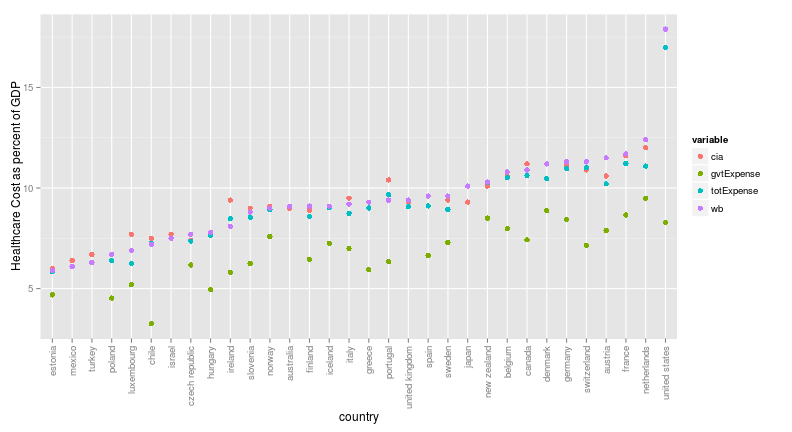

Homework 3
========================================================


Question 1
----------------
*Read  the  World  Bank  webpage  and  store  as  a  nice  data  frame.*  
*Source:  The  data  can  be  found  here: http://wdi.worldbank.org/table/4.1*  
*Hints:  You  can  try  readHTMLTable*  
*We  are  interested  in  the  third  table. [[3]]  will  select  the  third  element  in  a list.  Store  as  a  data  frame.  Rename  the  columns  to  be  meaningful.* 


```r
require(XML)
url <- "http://wdi.worldbank.org/table/4.1"
mytable <- readHTMLTable(url, colClasses = c("character", rep("numeric", 10)))[[3]]
```

I check my result with

```r
str(mytable)
```

To sum up, I have a dataframe with country names as characters and other columns containing numbers, and a lot of NAs where there are no values.

Some cleaning up, and naming the columns

```r
mytable[, 1] <- tolower(mytable[, 1])
names(mytable)[1] <- "Country"

h1 <- c("GDP", "Agriculture", "Industry", "Manufacturing", "Services")
h2 <- c("1990to2000", "2000to2012")

k <- 2
for (i in h1) {
    for (j in h2) {
        names(mytable)[k] <- paste0(i, j)
        k <- 1 + k
    }
}
```

My end result looks like

```
##          Country GDP1990to2000 GDP2000to2012
## 1    afghanistan            NA           9.4
## 2        albania           3.8           5.0
## 3        algeria           1.9           3.7
## 4 american samoa            NA            NA
## 5        andorra           3.2           5.9
```


Question 2
-----------
*Write  an  R  function  that  will  take  the name of  a  country  and  return  its  Avg Industrial  Growth  value for 2000‐2012.(Use your dataframe as the data source for your function to look up)*


```r
iG2000 <- function(country) {
    # the function assumes my dataframe is in my environment
    country <- tolower(country)
    if (!(country %in% mytable[, "Country"])) {
        stop("invalid country name")
    }
    
    print(paste(country, mytable[mytable$Country == country, "Industry2000to2012"], 
        sep = " "))
}
# I give 2 examples
iG2000("france")
```

```
## [1] "france 0"
```

```r
iG2000("india")
```

```
## [1] "india 8.2"
```


Question 3
----------------
*By  using  R  to  read  from Wikipedia,  create  a  data  frame  that  contains the names  of  countries and  their Healthcare  expenditure.  You  can  use  any wikipedia page  that  has  a  population  table  in  it. You  can  use any measure  of  healthcare  spending  that  you  find or  like*

I will be using this page http://en.wikipedia.org/wiki/Health_care_system. It contains data about 10 countries and gives the healthcare cost as percent of GDP. I am interested in the 1st and 8th columns.
Here is what I did and the result:

```r
url <- "http://en.wikipedia.org/wiki/Health_care_system"
mytable <- readHTMLTable(url, colClasses = c("character", rep("numeric", 9)))[[1]]
healthCost <- mytable[, c(1, 8)]
healthCost
```

```
##      Country Healthcare costs as a percent of GDP
## 1  Australia                                  8.5
## 2     Canada                                 10.0
## 3     France                                 11.0
## 4    Germany                                 10.4
## 5      Italy                                  8.7
## 6      Japan                                  8.2
## 7     Norway                                  8.9
## 8     Sweden                                  8.9
## 9         UK                                  8.4
## 10       USA                                 16.0
```


***BONUS***  

As I was browsing in search of data for my project, I stumbled upon some CIA's datasets.  
They happen to have health costs per GDP data, so let's see if wikipedia/OECD and the CIA data match.  
I downloaded the data from https://www.cia.gov/library/publications/the-world-factbook/rankorder/rawdata_2225.txt for the CIA set and http://stats.oecd.org/ for the OECD set.
After much trouble I ended up saving the data to my working directory (you can see the frustration in me going back to french)

```r
cia <- read.table("../ciahealth.txt", sep = "\t", quote = "", colClasses = c("NULL", 
    "character", "numeric"))
cia[, 1] <- tolower(cia[, 1])
ocde <- read.csv("../depensesSante.csv", header = T)
# This data set contains 3 columns:country, health cost general govt
# expense, total expense
names(ocde) <- c("country", "gvtExpense", "totExpense")
ocde <- within(ocde, country <- tolower(as.character(country)))
ocde <- within(ocde, gvtExpense <- as.numeric(as.character(gvtExpense)))
ocde <- within(ocde, totExpense <- as.numeric(as.character(totExpense)))
```

I merge the 2 datasets on country name. Since cia contains 190 countries and ocde 34, so I expect at most 34 rows.

```r
cia.ocde <- merge(cia, ocde, by.x = "V2", by.y = "country")
names(cia.ocde) <- c("country", "cia", "gvtExpense", "totExpense")
```

I see only 32 countries.
After cheking, 2 countries show a different name in the 2 data sets.
However, the most pressing issues is that only 0 values match.
With summary, can see some data closely match though  

```
##    country               cia          gvtExpense     totExpense   
##  Length:32          Min.   : 6.00   Min.   :3.25   Min.   : 5.85  
##  Class :character   1st Qu.: 7.70   1st Qu.:6.00   1st Qu.: 8.51  
##  Mode  :character   Median : 9.30   Median :7.07   Median : 9.03  
##                     Mean   : 9.44   Mean   :6.85   Mean   : 9.34  
##                     3rd Qu.:10.60   3rd Qu.:7.96   3rd Qu.:10.49  
##                     Max.   :17.90   Max.   :9.49   Max.   :16.99  
##                                     NA's   :6      NA's   :5
```


They do not share the same source, I give a look at the World Bank data
I could only get 2012 data, so I will have to look for similar data, and not a perfect match.

```r
url <- "http://wdi.worldbank.org/table/2.15"
wb <- readHTMLTable(url, colClasses = c("character", rep("numeric", 10)), which = 3)
wb <- wb[, 1:2]
wb <- within(wb, V1 <- tolower(V1))
cia.ocde.wb <- merge(cia.ocde, wb, by.x = "country", by.y = "V1")
colnames(cia.ocde.wb)[5] <- "wb"
```

I get an overview

```r
summary(cia.ocde.wb)
```

```
##    country               cia          gvtExpense     totExpense   
##  Length:32          Min.   : 6.00   Min.   :3.25   Min.   : 5.85  
##  Class :character   1st Qu.: 7.70   1st Qu.:6.00   1st Qu.: 8.51  
##  Mode  :character   Median : 9.30   Median :7.07   Median : 9.03  
##                     Mean   : 9.44   Mean   :6.85   Mean   : 9.34  
##                     3rd Qu.:10.60   3rd Qu.:7.96   3rd Qu.:10.49  
##                     Max.   :17.90   Max.   :9.49   Max.   :16.99  
##                                     NA's   :6      NA's   :5      
##        wb       
##  Min.   : 5.90  
##  1st Qu.: 7.78  
##  Median : 9.25  
##  Mean   : 9.41  
##  3rd Qu.:10.82  
##  Max.   :17.90  
## 
```

I can see the CIA and World Bank converge.  
A plot ?

```r
library(reshape2)
library(ggplot2)
```


```r
ordered <- cia.ocde.wb[order(cia.ocde.wb$wb), ]
order.melt <- melt(ordered, id.vars = "country")
order.melt$country <- factor(order.melt$country, levels = unique(order.melt$country), 
    ordered = T)
require(ggplot2)
p <- ggplot(data = order.melt, aes(x = country, y = value, colour = variable, 
    group = variable))
p <- p + geom_point(size = 2.5) + theme(axis.text.x = element_text(angle = 90, 
    vjust = 0.5, hjust = 1))
p <- p + ylab("Healthcare Cost as percent of GDP")
p
```

 


We can see some CIA closer to the World Bank data than the OECD ones, is it their source, or do they compile their own data set from scratch. We can see some discrepancies though, but since we live in a period of crisis, it can be explained by either a change in countries GDP between 2011 and 2012 or a change in health care policies.
I plotted the government expense as well, and though we can see some kind of linear dependency between the government expense and the total expense, I am not sure it would be relevant.

Question 4
------------
*Read the data file: KCASANTA142.csv*  
*Notice	that it	has	one	column	that	has	the	time and	the	date	and	the	time combined*	
*Create	new	columns	for	Month,	Day,	Year,	Hour	and	Minute	in	the	data	frame.*	
*You	can	write	a	function	and	use	lapply()*	

The file is in my working directory

```r
mydf <- read.csv("../KCASANTA142.csv", stringsAsFactors = F)
# I take my Time column and will make a list
timelist <- strsplit(mydf$Time, "\\-+|\\ |\\:")
# I reshape it as a df
library("plyr")
timedf <- ldply(timelist)
colnames(timedf) <- c("year", "month", "day", "hour", "minute", "second")
# I make my nice new df
mynewdf <- cbind(temperature = mydf$TemperatureF, timedf[, c("month", "day", 
    "year", "hour", "minute")])
```

After all that I have a 84482 by 6 data frame looking like

```r
head(mynewdf)
```

```
##   temperature month day year hour minute
## 1        49.5    01  01 2011   00     02
## 2        49.5    01  01 2011   00     07
## 3        49.4    01  01 2011   00     12
## 4        49.3    01  01 2011   00     18
## 5        49.3    01  01 2011   00     23
## 6        49.2    01  01 2011   00     28
```


*Crate a new data frame that would give at most one measure per hour.*

I can see 3 possibilities to do so, here they are and the result

```r
perhour <- aggregate(temperature ~ hour + day + month + year, data = mynewdf, 
    FUN = mean)
perhour2 <- ddply(mynewdf, .(year, month, day, hour), summarise, meanTemp = mean(temperature))
library(dplyr)
perhour3 <- mynewdf %.% group_by(year, month, day, hour) %.% summarise(meanTemp = mean(temperature))
dim(perhour)
```

```
## [1] 8641    5
```

```r
dim(perhour2)
```

```
## [1] 8641    5
```

```r
dim(perhour3)
```

```
## [1] 8641    5
```

```r
head(perhour2)
```

```
##   year month day hour meanTemp
## 1 2011    01  01   00    49.26
## 2 2011    01  01   01    49.23
## 3 2011    01  01   02    49.58
## 4 2011    01  01   03    47.21
## 5 2011    01  01   04    47.08
## 6 2011    01  01   05    47.80
```

